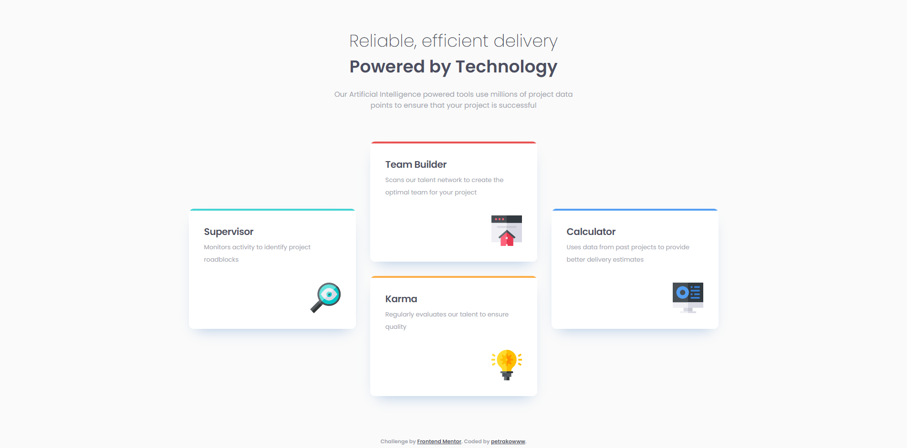
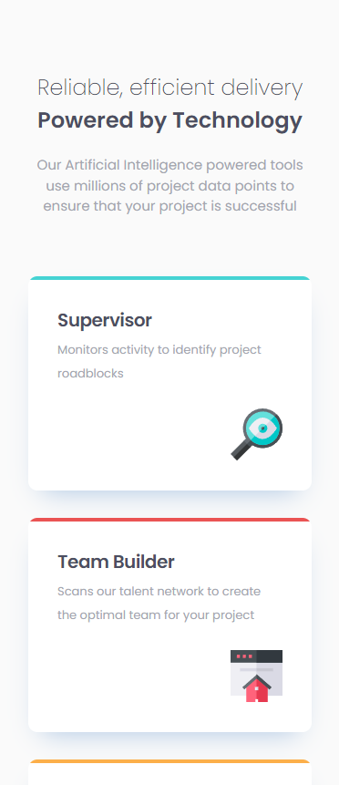

# Four Card Feature Section

## Описание

Этот проект был выполнен в рамках задания от [Frontend Mentor](https://www.frontendmentor.io).

## Задание

Задача заключалась в создании секции с четырьмя карточками и приближении её к представленному дизайну. В рамках этого проекта я реализовал:

- Адаптивный дизайн, который корректно отображается на различных устройствах.
- Использование SCSS для стилей, включая методологию БЭМ для организации классов и структурирования стилей.
- Применил подход mobile-first.
- Использовал media-запросы для обеспечения адаптивности.
- Использование Grid.

## Использованные технологии

- **HTML5**: Для структурирования содержимого карточек.
- **SCSS**: Для стилизации элементов, управления стилями с использованием переменных и вложенности.
- **CSS**: Скомпилированный из SCSS и использованный для окончательной стилизации страницы.

## Превью

### Для десктопных устройств

- 

### Для мобильных устройств

- 

## Ссылки

- [Frontend Mentor - Four Card Feature Section](https://www.frontendmentor.io/challenges/four-card-feature-section-weK1eFYK)
- [Мой GitHub](https://github.com/Petrakoow)
